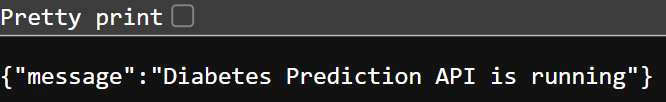
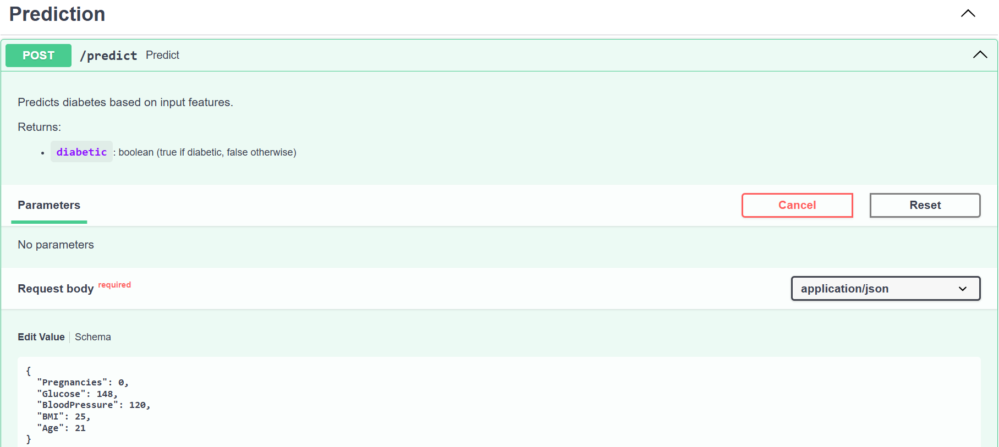
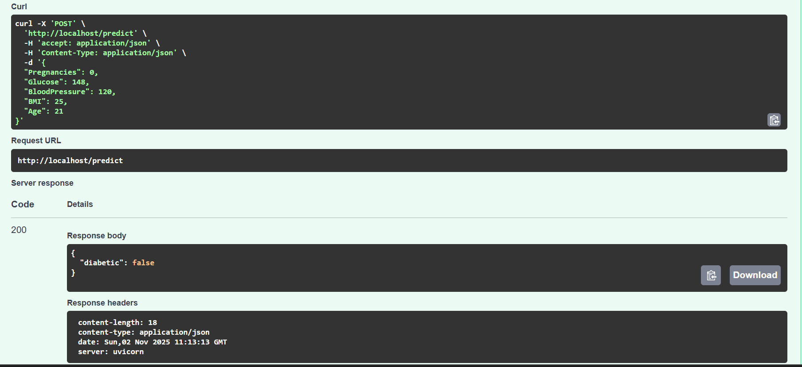

# 🩺 Diabetes Predictor

An end-to-end MLOps project that trains and deploys a machine learning model to predict diabetes based on patient health data. Built with **FastAPI**, **Docker**, and **Kubernetes**, this project demonstrates a real-world ML pipeline from training to deployment.

---

## 🧰 Tech Stack

- **Machine Learning:** `scikit-learn`, `pandas`, `joblib`
- **API Framework:** `FastAPI`
- **Containerization:** `Docker`
- **Orchestration:** `Kubernetes`
- **Dataset:** Pima Indians Diabetes Dataset

---
## 🚀 API Demo

The API provides two main endpoints and interactive documentation powered by Swagger UI.

### 1. Root Endpoint (`/`)
A simple health check endpoint to confirm the API is running.



### 2. Prediction Endpoint (`/docs`)
The interactive documentation allows you to easily test the `/predict` endpoint.



### 3. Example Prediction
You can send the patient's data as a JSON object to the `/predict` endpoint and receive a boolean prediction.



---

## 🧠 Machine Learning Model

This project uses a supervised machine learning model to perform a binary classification task (diabetic or not diabetic).

### Dataset
The model is trained on the **Pima Indians Diabetes Dataset**, a standard dataset from the UCI Machine Learning Repository. It contains health data for female patients of Pima Indian heritage.

### Features
To keep the model lightweight and fast for an API, we use the following **5 features**:
* `Pregnancies`: Number of times pregnant
* `Glucose`: Plasma glucose concentration
* `BloodPressure`: Diastolic blood pressure (mm Hg)
* `BMI`: Body mass index (weight in kg/(height in m)^2)
* `Age`: Age (years)

### Model
The model is a **Random Forest Classifier** from `scikit-learn`.

A Random Forest is an **ensemble learning** method. Instead of relying on a single decision tree, it builds many individual decision trees during training. When making a prediction, it collects the "vote" from each tree and chooses the class (diabetic or not) that receives the most votes. This approach is highly effective, more accurate than a single tree, and helps prevent overfitting.

---
## 📁 Project Structure

```bash
.
├── app
│   ├── __init__.py             # Makes 'app' a Python package
│   ├── main.py                 # FastAPI app logic
│   ├── model.py                # Model loading and prediction logic
│   ├── schema.py               # Pydantic data models
│   └── training
│       ├── __init__.py         # Makes 'training' a sub-package
│       └── trainer.py          # Model training script
├── .gitignore
├── Dockerfile                  # Multi-stage Dockerfile
├── k8s-deploy.yml              # Kubernetes deployment manifest
├── README.md
└── requirements.txt            # Python dependencies
```
---

## 🚀 Local Setup & Running
### 1️⃣ Clone the Repository
```bash
git clone https://github.com/your-username/mlops-diabetes-predictor.git
cd mlops-diabetes-predictor
```

### 2️⃣ Create and Activate Virtual Environment
```bash
python -m venv .venv
source .venv/bin/activate
```

### 3️⃣ Install Dependencies
```bash
pip install -r requirements.txt
```

### 4️⃣ Train the Model (For Local Testing)

This will run the training script and save ```diabetes_model.pkl``` to the project root.
The Docker build performs this step automatically.
```bash
python -m app.training.trainer
```

### 5️⃣ Run the FastAPI App Locally
```bash
uvicorn app.main:app --reload
```

##### Now access the interactive API docs at 👉 http://127.0.0.1:8000/docs
---
## 🐳 Docker & ☸️ Kubernetes Deployment

This section explains how to build, push, and deploy the API in the cloud.

### 1️⃣ Build the Docker Image

The multi-stage ```Dockerfile``` handles both model training and packaging.
```bash
#Replace 'your-username' with your Docker Hub username
docker build -t your-username/mlops-diabetes-predictor:latest .
```
### 2️⃣ Push to Docker Hub

Before deploying to Kubernetes, push the image to your registry.
```bash
# Log in (if not already)
docker login

# Push image
docker push your-username/mlops-diabetes-predictor:latest
```
### 3️⃣ Deploy to Kubernetes

Edit ```k8s-deploy.yml``` to set your correct Docker ```image:``` name, then apply:
```bash
kubectl apply -f k8s-deploy.yml
```
### 4️⃣ Get Your Public Link (URL)

Check the external IP for your ```LoadBalancer``` service:
```bash
kubectl get service diabetes-predictor-service --watch
```

Wait until the ```EXTERNAL-IP``` changes from ```<pending>``` to a real IP (e.g., ```20.123.45.67```).

Your API will then be publicly available at: ```http://<YOUR-EXTERNAL-IP>```. 
Access the Swagger UI docs at: ```http://<YOUR-EXTERNAL-IP>/docs```